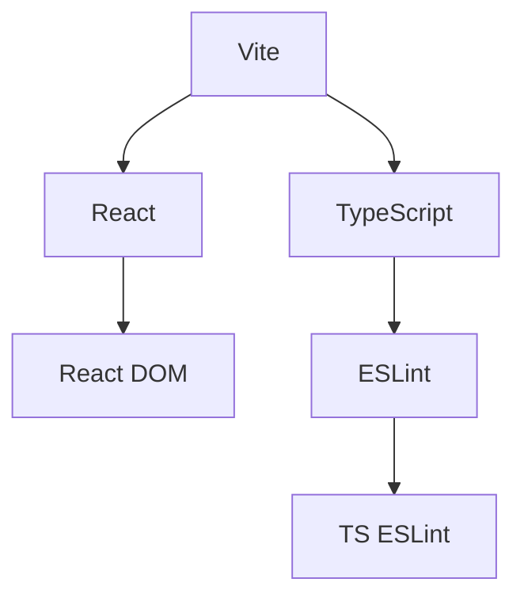
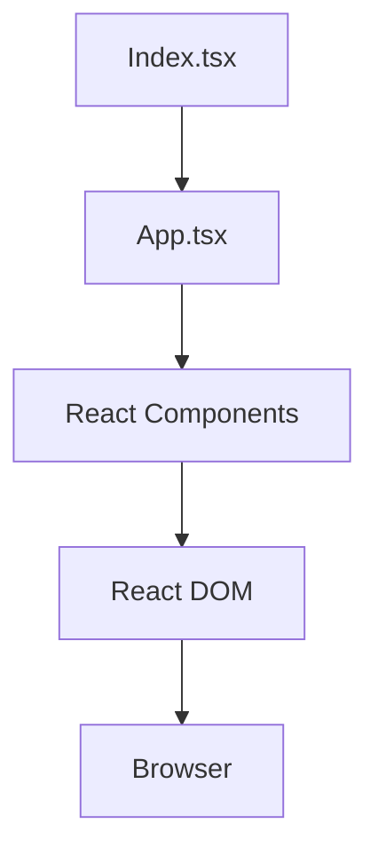

# One-like-away Architecture Overview

Overview of the One-like-away project structure and components

---

## system-overview

Main components and their relationships



## data-request-flow

How data moves through the system



## module-structure

Module structure and dependencies

```mermaid
flowchart TB
  subgraph React
    A[React] --> B[React DOM]
  end
  subgraph Vite
    C[Vite] --> D[@vitejs/plugin-react-swc]
  end
  subgraph TypeScript
    E[TypeScript] --> F[TS ESLint]
  end
  C --> A
  E --> A
```


---

*Generated by Repo Intelligence on 2026-02-09*
*Run `rintel diagram --update` to regenerate*
