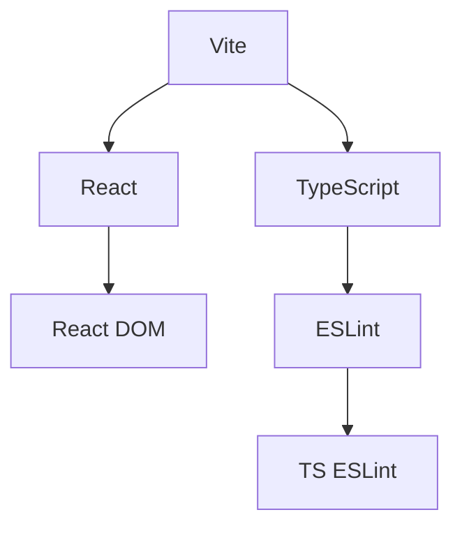
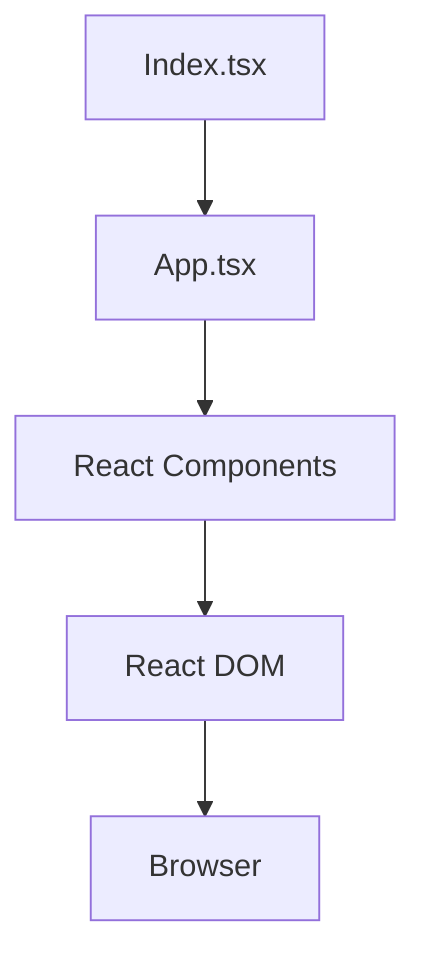

# Project Overview
The One-like-away project is a React-based application built using Vite, TypeScript, and ESLint. The project's primary purpose is to provide a minimal setup for getting React working in Vite with Hot Module Replacement (HMR) and some ESLint rules. The key goals of the project include setting up a development environment with Vite, configuring ESLint for type-aware lint rules, and creating a basic React application.

## High-Level Architecture
The high-level architecture of the One-like-away project can be visualized using the following Mermaid diagrams:

### System Overview

This diagram shows the main components of the project, including Vite, React, React DOM, TypeScript, ESLint, and TS ESLint. Vite is the build tool, React is the frontend framework, React DOM is the rendering engine, TypeScript is the programming language, ESLint is the linter, and TS ESLint is the TypeScript-specific linter.

### Data Request Flow

This diagram illustrates the data flow through the system, starting from the `Index.tsx` file, which renders the `App.tsx` component. The `App.tsx` component contains other React components, which are rendered by React DOM and ultimately displayed in the browser.

### Module Structure
```mermaid
flowchart TB
  subgraph React
    A[React] --> B[React DOM]
  end
  subgraph Vite
    C[Vite] --> D[@vitejs/plugin-react-swc]
  end
  subgraph TypeScript
    E[TypeScript] --> F[TS ESLint]
  end
  C --> A
  E --> A
```
This diagram shows the module structure and dependencies of the project. The React module depends on React DOM, the Vite module depends on the `@vitejs/plugin-react-swc` plugin, and the TypeScript module depends on TS ESLint. Vite and TypeScript both depend on React.

## Component Descriptions
The major components of the One-like-away project include:

* `Index.tsx`: The entry point of the application, which renders the `App.tsx` component.
* `App.tsx`: The main application component, which contains other React components.
* `React Components`: Various React components used in the application.
* `React DOM`: The rendering engine responsible for displaying the React components in the browser.
* `Vite`: The build tool used to manage the development environment and build the application.
* `TypeScript`: The programming language used to write the application code.
* `ESLint`: The linter used to enforce coding standards and detect errors.

## Data Flow
The data flow through the system is as follows:

1. The `Index.tsx` file renders the `App.tsx` component.
2. The `App.tsx` component contains other React components, which are rendered by React DOM.
3. React DOM displays the rendered components in the browser.

## Technology Stack
The technology stack used in the One-like-away project includes:

* React: The frontend framework used to build the application.
* Vite: The build tool used to manage the development environment and build the application.
* TypeScript: The programming language used to write the application code.
* ESLint: The linter used to enforce coding standards and detect errors.
* `@vitejs/plugin-react-swc`: The Vite plugin used to enable Fast Refresh for React components.
* `typescript-eslint`: The TypeScript-specific linter used to enforce coding standards and detect errors.

## Directory Structure
The directory structure of the One-like-away project is as follows:

* `docs/`: Contains documentation files, including the architecture document.
* `src/`: Contains the application code, including the `Index.tsx` and `App.tsx` files.
* `public/`: Contains public assets, such as the Vite logo.
* `node_modules/`: Contains dependencies installed using npm or yarn.
* `package.json`: Contains metadata about the project, including dependencies and scripts.
* `tsconfig.json`: Contains TypeScript configuration settings.
* `vite.config.ts`: Contains Vite configuration settings.

## Key Design Decisions
Some notable design decisions made in the One-like-away project include:

* Using Vite as the build tool to enable Hot Module Replacement (HMR) and fast development.
* Using TypeScript as the programming language to enforce type safety and improve code maintainability.
* Using ESLint to enforce coding standards and detect errors.
* Using the `@vitejs/plugin-react-swc` plugin to enable Fast Refresh for React components.

## Extension Points
New functionality can be added to the One-like-away project by:

* Creating new React components in the `src/` directory.
* Adding new dependencies to the `package.json` file.
* Configuring new ESLint rules in the `eslint.config.js` file.
* Updating the Vite configuration in the `vite.config.ts` file.
* Adding new TypeScript configuration settings in the `tsconfig.json` file.

---

*Generated by Repo Intelligence on 2026-02-09*
*Architecture diagrams from `docs/architecture/ARCHITECTURE.md`*
*Run `rintel architecture --update` to regenerate this document*
